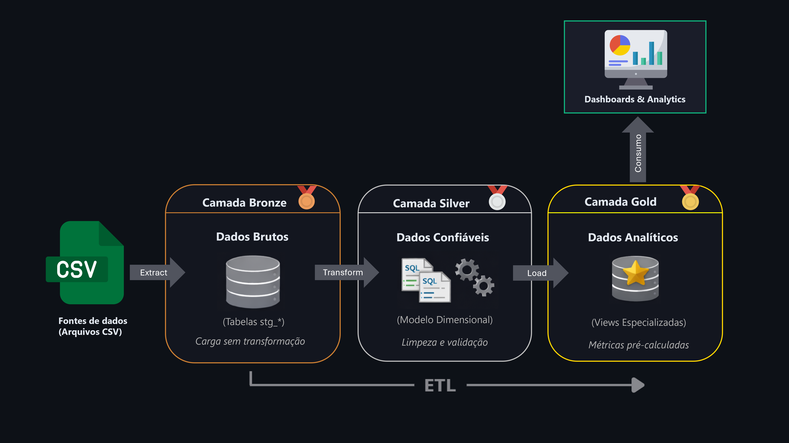
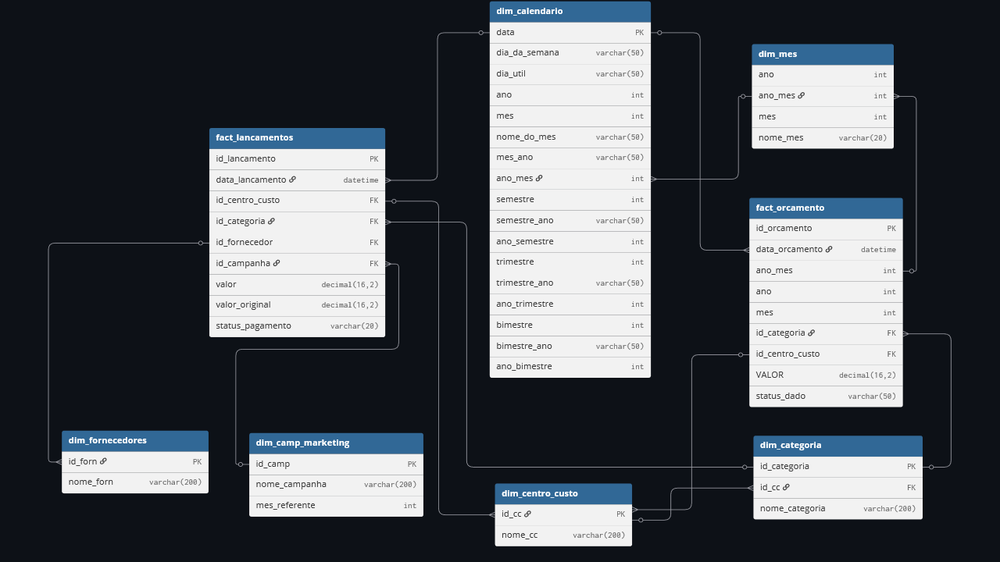

# 📊 Controle Orçamentário — Pipeline de Dados e Analytics

> Pipeline completo de ETL simulando gestão orçamentária corporativa, com foco em qualidade de dados e modelagem dimensional


---

## 🎯 Visão Geral

Este projeto simula um pipeline de dados financeiro-orçamentário completo, cobrindo desde a ingestão de dados brutos até a entrega de uma base analítica confiável para consumo em dashboards.

O objetivo não é apenas gerar visualizações, mas construir uma **infraestrutura de dados** que trate problemas reais encontrados em ambientes corporativos:

- Baixa padronização de dados na origem
- Falhas de integridade referencial
- Inconsistências semânticas
- Ausência de validações antes da análise

---

## 🏢 Contexto de Negócio

**Sage** é uma empresa fictícia do setor de serviços criada como contexto para este projeto de portfólio.

### Problema Simulado

Empresas de serviços frequentemente enfrentam desafios na gestão orçamentária:

- Dados financeiros provenientes de múltiplas fontes
- Dificuldade em consolidar orçado vs realizado
- Baixa confiabilidade dos indicadores financeiros
- Dependência excessiva de tratamentos manuais no BI

Este projeto simula esse cenário e propõe uma abordagem estruturada para lidar com esses problemas.

### Abordagem de Solução

Para lidar com os desafios apresentados, o projeto foi pensado a partir de alguns princípios simples:

- Centralizar os dados financeiros em uma única base confiável  
- Separar claramente dados brutos, dados tratados e dados prontos para análise  
- Aplicar validações antes da análise, reduzindo a necessidade de correções no BI  
- Manter rastreabilidade das informações, permitindo investigar inconsistências até a origem do dado  


---

## 🏗️ Arquitetura

O projeto segue o padrão **Medallion Architecture** (Bronze → Silver → Gold), com separação clara de responsabilidades:



### Camadas implementadas:

- **🥉 Bronze**  
  Ingestão de dados brutos via Python e `BULK INSERT`, preservando o formato original e sem regras de negócio.

- **🥈 Silver**  
  Aplicação de validações de qualidade, padronizações e modelagem dimensional (Star Schema), garantindo integridade referencial e consistência semântica.

- **🥇 Gold**  
  Views analíticas especializadas (Orçamento, Realizado, Lançamentos), com métricas pré-calculadas e estrutura pronta para consumo no Power BI.

📖 **[Documentação completa do pipeline](pipeline/)**

### Modelo Dimensional (Star Schema)



A camada Silver implementa um modelo dimensional completo com:
- 📊 **2 Fatos**: Orçamento (mensal) e Lançamentos (diário)
- 📋 **5 Dimensões**: Centro de Custo, Categoria, Fornecedores, Campanhas, Calendário
- 🔗 **Integridade Referencial**: Todas as foreign keys validadas via constraints

📖 **[Ver documentação técnica completa →](pipeline/02_silver/)**

---

## 🧭 Como Navegar Neste Repositório

Este repositório está organizado em **dois níveis de documentação**:

### 📄 Nível 1: Visão Geral (este README)
Contexto de negócio, arquitetura geral e resultados do projeto

### 📂 Nível 2: Documentação Técnica Detalhada
Cada camada do pipeline possui documentação técnica específica em seu diretório:

- **[pipeline/](pipeline/)** → Conceitos da Medallion Architecture
  - **[pipeline/bronze/](pipeline/01_bronze/)** → Ingestão e scripts Python/SQL
  - **[pipeline/silver/](pipeline/02_silver/)** → Validações, transformações e modelo dimensional
  - **[pipeline/gold/](pipeline/03_gold/)** → Views analíticas e métricas calculadas
- **[dashboards/](dashboards/)** → Visualizações Power BI e decisões de BI

---

## 📊 Estrutura do Projeto
```
📦 controle-orcamentario-analytics-pipeline/
│
├── 📂 pipeline/          # Camadas de ETL (Bronze, Silver, Gold)
├── 📂 dashboards/        # Visualizações Power BI
├── 📂 data/              # Dados sintéticos (CSVs)
├── 📂 docs_e_imagens/    # Diagramas e documentação visual
├── 📄 registros.md       # Diário de desenvolvimento
└── 📄 README.md          # Este arquivo
```

---

## 🛠️ Stack Utilizada

| Tecnologia | Uso |
|------------|-----|
| **SQL Server** | ETL, modelagem dimensional, transformações |
| **Python (Pandas)** | Geração de dados sintéticos |
| **Power BI** | Visualização e análise |
| **Git/GitHub** | Versionamento e documentação |

---

## ✅ Principais Diferenciais

### 1. Framework de Qualidade de Dados
- Validações aplicadas antes da persistência na camada Silver
- Diagnósticos de integridade temporal, referencial e semântica
- Tratamento defensivo de anomalias (flags ao invés de exclusão)

### 2. Modelagem Dimensional
- Star Schema com 5 dimensões e 2 fatos
- Integridade referencial garantida via constraints
- dim_calendario para continuidade temporal

### 3. Camada Gold Especializada
- 3 views independentes com responsabilidades bem definidas
- Métricas avançadas: YTD, MoM, YoY, pesos relativos
- Cruzamento Orçado vs Realizado realizado no Power BI

### 4. Rastreabilidade
- Transformações via Views para auditoria completa
- Preservação de valores originais para investigação
- Flags de qualidade em toda a pipeline

### 5. Sistema de Alertas Preventivos 

- Monitoramento intramês baseado em mediana histórica
- Alertas de desvio de ritmo de gasto antes do fechamento
- Cálculo robusto contra outliers
- Flags categorizadas (Abaixo / Dentro / Acima do normal)

---

## 📈 Resultados

Após aplicação das regras de ETL e qualidade:

- ✅ 100% dos registros na Silver respeitam tipagem e integridade referencial
- ✅ 92 registros problemáticos identificados e tratados automaticamente 
- ✅ Modelo dimensional pronto para consumo sem tratamentos adicionais em DAX
- ✅ 16+ métricas analíticas disponíveis (YTD, MoM, YoY, etc)
- ✅ Métricas de Orçado vs Realizado com regras de negócio explícitas
- ✅ Risco de erros silenciosos mitigado na camada de dados

---

## 📌 Status e Próximos Passos

**Status atual:** Camadas Bronze, Silver e Gold implementadas e documentadas

**Próximos passos:**
- [ ] Desenvolvimento dos dashboards no Power BI
- [ ] Publicação de visualizações finais

---

## 📬 Sobre Este Projeto

Este projeto faz parte de um portfólio de dados, desenvolvido com foco em boas práticas de engenharia analítica e qualidade de dados.

A documentação técnica completa de cada etapa está disponível nos respectivos diretórios do repositório.

Feedbacks e sugestões são bem-vindos através das issues do GitHub ou por mensagem no meu **[Linkedin](https://www.linkedin.com/in/lucas-pires-da-hora/)**.

---
