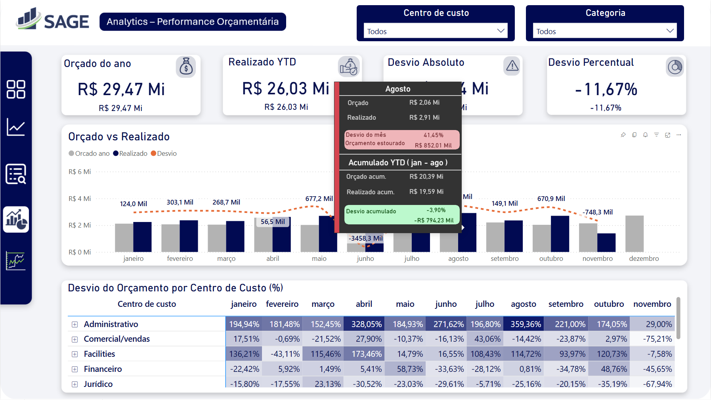
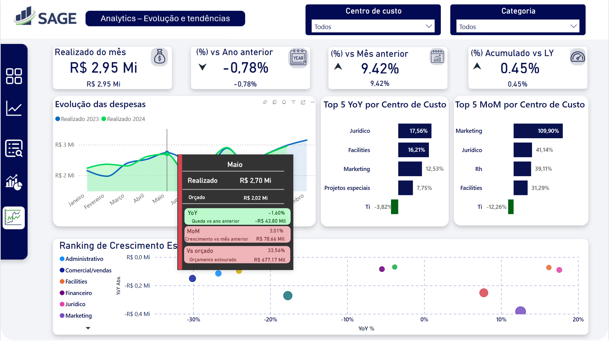

# Dashboard — Visualização e Analytics

## Responsabilidade

Camada de consumo final do pipeline. Consome diretamente as views da camada Gold sem transformações adicionais no Power Query. As agregações diárias, medianas históricas, YTD, MoM e YoY chegam prontos do SQL. O Power BI foca em relacionamentos, contexto de filtro e visualização.

O relatório está organizado em quatro páginas com contextos analíticos distintos: monitoramento preventivo intra-mês e análise executiva retrospectiva. A navegação entre páginas é feita pelo menu lateral com botões dedicados.

Publicado no **Power BI Service**.

---

## 📂 Estrutura de Arquivos

```
dashboards/
├── README.md
└── controle_orcamentario.pbix
```

Arquivo único com navegação interna por páginas — evita duplicação do modelo semântico, simplifica o versionamento e garante consistência de métricas entre as visões.

---

## 📊 Páginas

### 1. Operacional — Monitoramento

Monitoramento preventivo intra-mês: ritmo de consumo vs orçado ideal e semáforo de risco por centro de custo.


**Destaques:**
- Gráfico de linhas com quatro séries: Orçado Ideal MTD, Realizado MTD, Mediana Histórica MTD e Projeção de Fechamento
- Orçado Ideal calculado em DAX usando `peso_do_dia` — distribuição não-linear do orçamento mensal conforme ritmo real histórico de gastos
- Projeção de fechamento baseada na taxa de gasto diária atual
- Tabela de indicadores de risco por centro de custo com semáforo: acima do normal, risco de estouro, estouro confirmado e estouro do orçamento do ano.

**Views consumidas:** `vw_gold_lancamentos`, `vw_gold_orcamento`, `vw_gold_referencia_mtd`

---

### 2. Operacional — Detalhamento

Detalhamento transacional do período com visão de pendências financeiras e ranking por categoria e fornecedor.


**Destaques:**
- Tabela de lançamentos por dia com status de pagamento e % do período acumulado
- KPIs de pendências: total pendente e % ainda pendente
- Top 5 categorias e Top 5 fornecedores por valor gasto

**Views consumidas:** `vw_gold_lancamentos`, `vw_gold_orcamento`

---

### 3. Analytics — Performance Orçamentária

Visão executiva sobre a aderência ao orçamento por mês e por centro de custo.




**Destaques:**
- Gráfico combinado: barras agrupadas (Orçado vs Realizado) com linha de desvio sobreposta
- KPIs anuais: Orçado YTD, Realizado YTD, Desvio Absoluto e Desvio Percentual
- Matriz de desvio por centro de custo × mês com formatação condicional por intensidade
- Tooltip por mês: orçado, realizado, desvio do mês, desvio acumulado YTD — cor indica estouro ou aderência

**Views consumidas:** `vw_gold_orcamento`, `vw_gold_realizado`

---

### 4. Analytics — Evolução e Tendências

Análise de crescimento e sazonalidade de gastos com comparativo entre anos.




**Destaques:**
- Gráfico de área comparando 2023 vs 2024 para leitura de sazonalidade
- KPIs de variação: YoY (%), MoM (%), Acumulado vs LY
- Top 5 centros de custo com maior crescimento YoY e Top 5 com maior crescimento MoM
- Gráfico de dispersão de crescimento estrutural: YoY % × YoY Absoluto por centro de custo
- Tooltip por mês: realizado, orçado, YoY, MoM e desvio vs orçado — cor indica estouro ou aderência
- Métricas temporais chegam prontas da Gold via `LAG()` — calculadas no SQL, sem risco de distorção por meses sem lançamentos

**Views consumidas:** `vw_gold_realizado`

---

## 🎯 Decisões Técnicas

### Processamento na camada de dados

Cálculos estruturais são resolvidos no SQL Server (camada Gold) e chegam prontos para consumo. O Power BI foca em relacionamentos, contexto de filtro e visualização.

### Separação de views somáveis vs. de referência

A `vw_gold_referencia_mtd` não é agregada via `SUM()`. É consultada pontualmente via `CALCULATE(..., dia = DiaAtual)`, evitando distorção de benchmarks ao filtrar múltiplos centros de custo simultaneamente.

### Orçado Ideal não-linear

O orçamento mensal é distribuído conforme o `peso_do_dia` — percentual mediano acumulado histórico por dia — em vez de distribuição linear. Reflete o ritmo real de consumo de cada área da empresa.

### Medida DAX central

```dax
Orçado Ideal MTD =
VAR DiaAtual = DAY(MAX(dim_calendario[data]))
VAR PesoHistorico =
    CALCULATE(
        MAX(vw_gold_referencia_mtd[peso_do_dia]),
        vw_gold_referencia_mtd[dia] = DiaAtual,
        ALLEXCEPT(vw_gold_referencia_mtd, vw_gold_referencia_mtd[id_centro_custo], vw_gold_referencia_mtd[id_categoria])
    )
VAR OrcamentoMensal = [Total Orçado]
RETURN
    IF(
        NOT ISBLANK(OrcamentoMensal) && NOT ISBLANK(PesoHistorico),
        OrcamentoMensal * PesoHistorico,
        BLANK()
    )
```

---

## 📋 Modelo de Dados

| View | Tipo | Granularidade | Somável? | Uso principal |
|---|---|---|---|---|
| `vw_gold_orcamento` | Fato | Mensal | ✅ Sim | Planejamento financeiro |
| `vw_gold_realizado` | Fato | Mensal | ✅ Sim | Análise executiva retrospectiva |
| `vw_gold_lancamentos` | Fato | Diária | ✅ Sim | KPIs operacionais, tabela de lançamentos |
| `vw_gold_lancamentos_diarios` | Fato | Diária | ✅ Sim | Grid diário completo com acumulado MTD |
| `vw_gold_referencia_mtd` | Referência | Dia do mês | ❌ Não | Linhas de benchmark e orçado ideal |

Relacionamentos via `dim_calendario` (data), `id_centro_custo` e `id_categoria`. 