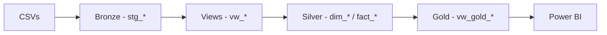

# Pipeline de Dados — Medallion Architecture

## Visão Geral

Este pipeline implementa o padrão **Medallion Architecture**, organizando o fluxo de dados em três camadas com responsabilidades bem definidas.

Cada camada possui documentação técnica detalhada em seu respectivo diretório.

---

## 🎯 Conceito da Arquitetura Medallion

A Medallion Architecture organiza dados em camadas progressivas de qualidade e refinamento:
```
Bronze (Raw) → Silver (Trusted) → Gold (Analytics)
```

### Benefícios desta abordagem:

- **Separação de responsabilidades**: Cada camada tem um propósito específico
- **Rastreabilidade**: Auditoria completa das transformações aplicadas
- **Recuperabilidade**: Reprocessamento de camadas específicas sem afetar outras
- **Qualidade**: Validações em cada etapa antes da próxima camada

---

## 🥉 Camada Bronze — Ingestão

**Responsabilidade**: Receber dados brutos sem aplicar transformações

**Características**:
- Todas as colunas armazenadas como `VARCHAR` (máxima flexibilidade)
- Nenhuma validação ou tipagem aplicada
- Preservação integral dos dados originais
- Ingestão via Python (Pandas) + BULK INSERT

**Objetivo**: Garantir que a carga nunca falhe por incompatibilidade de tipos

📖 **[Documentação técnica da Bronze](bronze/)**

---

## 🥈 Camada Silver — Limpeza e Modelagem

**Responsabilidade**: Limpar, tipar e estruturar dados em modelo dimensional

**Características**:
- Transformações realizadas via **Views** (auditáveis e reversíveis)
- Dados tipados corretamente
- Modelo dimensional em **Star Schema**
- Integridade referencial garantida (`PRIMARY KEY` + `FOREIGN KEY`)
- Framework completo de validação de qualidade

**Componentes**:
- 4 dimensões (`dim_centro_custo`, `dim_categoria`, `dim_fornecedores`, `dim_camp_marketing`)
- 1 dimensão temporal (`dim_calendario`)
- 2 tabelas fato (`fact_orcamento`, `fact_lancamentos`)

📖 **[Documentação técnica da Silver](silver/)**

---

## 🥇 Camada Gold — Métricas Analíticas

**Responsabilidade**: Preparar dados para consumo analítico no Power BI

**Características**:
- 3 views especializadas com propósitos distintos
- Métricas pré-calculadas (YTD, MoM, YoY, pesos relativos)
- Proteção contra erros (NULLIF, COALESCE)
- Flags de anomalias e valores atípicos

**Views implementadas**:
- `vw_gold_orcamento`: Consolidação mensal do orçamento
- `vw_gold_realizado`: Consolidação mensal do realizado com métricas avançadas
- `vw_gold_lancamentos`: Base detalhada para drill-down

**Decisão arquitetural**: Cruzamento Orçado vs Realizado é realizado no Power BI, não na camada de dados

📖 **[Documentação técnica da Gold](gold/)**

---

## 🔄 Fluxo de Dados


### Etapas do pipeline:

1. **Geração de dados** (Python): CSVs sintéticos simulando sistema financeiro
2. **Ingestão** (Bronze): BULK INSERT sem transformações
3. **Transformação** (Views): Limpeza, tipagem, validações
4. **Persistência** (Silver): Modelo dimensional com constraints
5. **Agregação** (Gold): Views analíticas especializadas
6. **Visualização** (Power BI): Dashboards e análises

---

## 📊 Qualidade de Dados

O pipeline implementa validações em múltiplos pontos:

| Etapa | Validação | Ação |
|-------|-----------|------|
| Bronze → Silver | Datas nulas | Descarte controlado |
| Bronze → Silver | IDs inválidos | Uso de membro coringa `-1` |
| Bronze → Silver | Tipagem incorreta | Conversão `FLOAT → INT` |
| Bronze → Silver | Status inconsistentes | Normalização semântica |
| Silver → Gold | Valores extremos | Flags de anomalia |
| Silver → Gold | Divisão por zero | Proteção com `NULLIF` |

---

## 🛠️ Tecnologias Utilizadas

- **SQL (SQL Server)**: Armazenamento, transformações, modelagem dimensional
- **Python (Pandas)**: Geração de dados sintéticos, ingestão
- **Power BI**: Consumo das views Gold

---

## 📌 Decisões de Arquitetura

### Uso de Views ao invés de Stored Procedures

Views foram adotadas para as transformações devido a:

- **Auditoria**: Código SQL visível e versionável
- **Rastreabilidade**: Possibilidade de investigar transformações aplicadas
- **Flexibilidade**: Mudanças não requerem reprocessamento de dados físicos
- **Simplicidade**: Menos estado a gerenciar

Essa escolha facilita o debug e permite ajustes nas regras de negócio sem recarregar dados da Bronze.

### Separação da Gold em 3 Views Independentes

A camada Gold foi dividida em views especializadas (Orçamento, Lançamentos, Realizado) ao invés de uma view consolidada.

**Razões para essa decisão**:

- Cada view tem responsabilidade única e clara
- Evita redundância de dados pré-calculados
- Facilita manutenção (mudanças em uma view não afetam outras)
- Permite consumo flexível no Power BI

**Contrapartida**: Power BI precisa fazer joins entre as views. Esse custo computacional é baixo e compensa pelos benefícios organizacionais.

---

## 📖 Documentação Adicional

- 📂 **[Bronze](bronze/)**: Ingestão e estruturas staging
- 📂 **[Silver](silver/)**: Modelo dimensional e validações
- 📂 **[Gold](gold/)**: Views analíticas e métricas

---