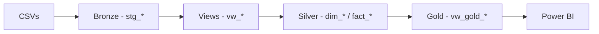

# Pipeline de Dados — Medallion Architecture

## Visão Geral

Este pipeline implementa o padrão **Medallion Architecture**, organizando o fluxo de dados em três camadas com responsabilidades bem definidas.

Cada camada possui documentação técnica detalhada em seu respectivo diretório.

---

## 🏗️ Arquitetura Medallion

O pipeline segue o padrão Bronze -> Silver -> Gold, com cada camada tendo responsabilidade exclusiva: Bronze preserva os dados exatamente como chegaram, Silver aplica todas as regras de qualidade e negócio, Gold entrega estruturas prontas para consumo analítico. A documentação de cada camada detalha as decisões tomadas em cada etapa.

```
Bronze (Raw) → Silver (Trusted) → Gold (Analytics)
```

---

## 🥉 Camada Bronze — Ingestão

**Responsabilidade**: Receber dados brutos sem aplicar transformações

**Características**:
- Todas as colunas armazenadas como `VARCHAR`, a tipagem é responsabilidade da Silver
- Nenhuma validação aplicada
- Preservação integral dos dados originais
- Ingestão via `BULK INSERT`

**Objetivo**: Garantir que a carga nunca falhe por incompatibilidade de tipos

📖 **[Documentação técnica da Bronze](01_bronze/)**

---

## 🥈 Camada Silver — Limpeza e Modelagem

**Responsabilidade**: Limpar, tipar e estruturar dados em modelo dimensional

**Características**:
- Transformações realizadas via **Views** (auditáveis e reversíveis)
- Dados tipados corretamente
- Modelo dimensional em **Star Schema**
- Integridade referencial garantida (`PRIMARY KEY` + `FOREIGN KEY`)
- Framework completo de validação de qualidade

**Componentes**:
- 5 dimensões: `dim_centro_custo`, `dim_categoria`, `dim_fornecedores`, `dim_camp_marketing`, `dim_mes`
- 1 dimensão temporal: `dim_calendario`
- 2 tabelas fato: `fact_orcamento`, `fact_lancamentos`

📖 **[Documentação técnica da Silver](02_silver/)**

---

## 🥇 Camada Gold — Métricas Analíticas

**Responsabilidade**: Preparar dados para consumo analítico no Power BI

**Características**:
- 5 views especializadas com propósitos distintos
- Métricas pré-calculadas (YTD, MoM, YoY, pesos relativos)
- Proteção contra erros (`NULLIF`, `COALESCE`)
- Flags de anomalias e valores atípicos

**Views implementadas**:
- `vw_gold_orcamento`: Consolidação mensal do orçamento
- `vw_gold_realizado`: Consolidação mensal do realizado com métricas avançadas
- `vw_gold_lancamentos`: Base detalhada para drill-down
- `vw_gold_referencia_mtd`: Benchmark histórico de consumo diário baseado em mediana
- `vw_gold_lancamentos_diarios`: Grid diário completo com acumulado MTD

**Decisão arquitetural**: Cruzamento Orçado vs Realizado é realizado no Power BI, não na camada de dados

📖 **[Documentação técnica da Gold](03_gold/)**

---

## 🔄 Fluxo de Dados


```mermaid
graph LR
    A[CSVs] --> B[Bronze - stg_*]
    B --> C[Views - vw_*]
    C --> D[Silver - dim_* / fact_*]
    D --> E[Gold - vw_gold_*]
    E --> F[Power BI]
```

### Etapas do pipeline:

1. **Ingestão** (Bronze): `BULK INSERT` sem transformações
2. **Transformação** (Views): Limpeza, tipagem, validações
3. **Persistência** (Silver): Modelo dimensional com constraints
4. **Agregação** (Gold): Views analíticas especializadas
5. **Visualização** (Power BI): Dashboards e análises

---

## 📊 Qualidade de Dados

O pipeline implementa validações em múltiplos pontos:

| Etapa | Validação | Ação |
|-------|-----------|------|
| Bronze → Silver | Datas nulas | Descarte controlado |
| Bronze → Silver | IDs inválidos | Uso de membro coringa `-1` |
| Bronze → Silver | Tipagem incorreta | Conversão `FLOAT → INT` |
| Bronze → Silver | Status inconsistentes | Normalização semântica |
| Silver → Gold | Valores extremos | Flags de anomalia |
| Silver → Gold | Divisão por zero | Proteção com `NULLIF` |

---

## 🛠️ Stack Utilizada

- **SQL (SQL Server)**: Armazenamento, transformações, modelagem dimensional
- **Power BI**: Consumo das views Gold

---

## 📌 Decisões de Arquitetura

### Separação da Gold em Views Independentes

A camada Gold foi dividida em views especializadas ao invés de uma view consolidada.

**Razões para essa decisão**:

- Cada view tem responsabilidade única e clara
- Evita redundância de dados pré-calculados
- Facilita manutenção — mudanças em uma view não afetam outras
- Permite consumo flexível no Power BI

---

## 📖 Documentação Adicional

- 📂 **[Bronze](01_bronze/)**: Ingestão e estruturas staging
- 📂 **[Silver](02_silver/)**: Modelo dimensional e validações
- 📂 **[Gold](03_gold/)**: Views analíticas e métricas

---
